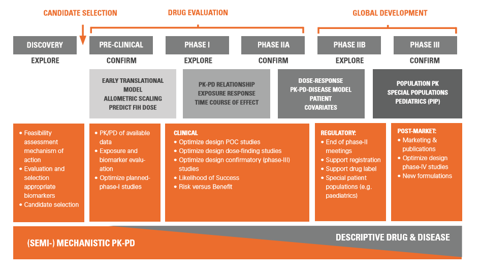

```{r setup, include=FALSE}
knitr::opts_chunk$set(echo = FALSE)
library(RxODE)
library(shiny)
library(ggplot2)
library(plotly)
library(dplyr)
library(forcats)
library(waiter)
```
<style>
div.footnotes {
  position: absolute;
  bottom: 0;
  margin-bottom: 10px;
  width: 80%;
  font-size: 0.6em;
}
</style>

<script src="https://ajax.googleapis.com/ajax/libs/jquery/3.1.1/jquery.min.js"></script>
<script>
$(document).ready(function() {
  $('slide:not(.backdrop):not(.title-slide)').append('<div class=\"footnotes\">');

  $('footnote').each(function(index) {
    var text  = $(this).html();
    var fnNum = (index+1).toString();
    $(this).html(fnNum.sup());

    var footnote   = fnNum + '. ' + text + '<br/>';
    var oldContent = $(this).parents('slide').children('div.footnotes').html();
    var newContent = oldContent + footnote;
    $(this).parents('slide').children('div.footnotes').html(newContent);
  });
});
</script>


## About me

* Ruben Faelens
  * Belgian, living in Leuven
  * Just call me 'Ruben'

* Computer Scientist, graduated 2010
* PK/PD modeling & simulation from 2012 onward
* Wrote _simulo_, a clinical trial simulation software
* Consultant for pharma industry from 2014 - 2018

* Working at *KULeuven* as PhD researcher
  * MI(MIPD)D: informed development of precision dosing tools
  * Paving the road towards precision dosing

## Simulation of pharmacometric models
<iframe width="560" height="315" src="https://www.youtube.com/embed/o2ntCRCgpUM" title="YouTube video player" frameborder="0" allow="accelerometer; autoplay; clipboard-write; encrypted-media; gyroscope; picture-in-picture" allowfullscreen></iframe>


## Modeling & Simulation: why?
- Deeper understanding of the compound and mechanisms
- Predict candidate treatment
- Answer what-if scenario
- Predict candidate trial
- Optimize trial, minimize risk

## Model-informed drug development
```{r}

```

## What kind of questions can we address?
* What is the best dose and administration interval?
* What is the best sampling schedule?
* Which protocol design will we choose?
* How many subjects do I enrol in the next phase study?
* Which proportion of my population will be well treated?
* What is the best population targeted by the drug?
* Will you continue this drug development?
* Can we look at another dosage form?
* Having information on other doses, what is the mean effect of a 100mg dose after 2 weeks of treatment?
* What is the probability of success in phase III?

## Limitations
* Explain everything
* Give you the answer you want
* Find an effect where none exists
* Provide one “true” answer
* Make good studies unnecessary
* Make a silk purse out of a sow’s ear
* Make your decisions for you

## A structured approach
- Modeling & Goodness of Fit
- Population simulation
- Probability of Technical Success
- Clinical trial simulation
- Probability of Study Success

# Hands-on
## Sunitinib
Sunitinib is a multi-targeted tyrosine kinase inhibitor used in the treatment of advanced renal cell carcinoma (RCC) and imatinib-resistant/intolerant gastrointestinal stromal tumors (GIST). It gained market access in 2006.


Khosravan et al <footnote>Reza Khosravan et al. Population Pharmacokinetic/Pharmacodynamic Modeling of Sunitinib by Dosing Schedule in Patients with Advanced Renal Cell Carcinoma or Gastrointestinal Stromal Tumor. Clin Pharmacokinet (2016) 55:1251–1269 <footnote> published a model predicting PK and several PD endpoints.

----


----


# Typical value simulations

```{r}
textAreaInput("model", label="Model", value="
KA=0.126;
Vc=2700;
CL=34.1;
Vp=774;
Q=0.688;
TLag = 0.527;

d/dt(A0) = -KA*A0;
alag(A0) = TLag;
d/dt(A1) = KA*A0 - CL/Vc * A1 - Q/Vc * A1 + Q/Vp*A2;
d/dt(A2) = Q/Vc*A1 - Q/Vp*A2;
CONC = A1 / Vc * 1000;
d/dt(CAUC) = CONC;
")
```

----

These simulations predict a single profile using the typical value parameters.

```{r}
inputPanel(
  numericInput("dose", label="Dose (mg)", value=50),
  numericInput("nbr.doses", label="Number of doses", value=1),
  numericInput("interval", label="Dosing interval", value=24, min=1, max=7*24),
  selectizeInput("plotItems", label="plot", choices = c("CONC", "A0", "A1", "A2", "CAUC"), selected="CONC", multiple=TRUE),
  numericInput("observeDays", label="Days", value=7),
  checkboxInput("keepLast", label="Keep last plot", value=TRUE)
)
```

```{r typical-value}
db <- reactiveVal(data.frame())
renderPlotly({
  m1 <- RxODE::RxODE(input$model)
  events <- eventTable() %>%
    add.dosing(dose=as.numeric(input$dose), nbr.doses=as.numeric(input$nbr.doses), dosing.interval=as.numeric(input$interval)) %>%
    add.sampling(seq(0, as.numeric(input$observeDays)*24, by=0.1))
  result <- rxSolve(m1, events=events)
  resultLong <- tidyr::pivot_longer(result, cols=input$plotItems)
  
  dbObj <- isolate({ db() })
  resultLong$i <- max(c(0,dbObj$i)) + 1
  if(isTRUE(input$keepLast) && all(input$plotItems %in% unique(dbObj$name) ) ) {
    db( bind_rows(dbObj, resultLong))
  } else {
    db( resultLong) 
  }
  z1 <- ggplot(isolate({db()}), aes(x=time, y=value, color=name)) +
    geom_line(aes(group=i)) +
    scale_x_continuous(breaks=seq(0, 356)*24*ifelse(as.numeric(input$observeDays)>14,7,1), name="Time (hours)") + labs(color="")
  z1
})
```

## Questions
* Change the parameter values. Predict what will happen. Do this for KA, Vc, CL, Vp, Q.
* Can you predict key PK properties? Cmax, Tmax? What is AUC for 1 dose?
* What is the steady-state concentration? What is the peak-to-trough ratio? How long is the typical washout period to have 90% eliminated?
* What dose is required for a single-dose exposure of 3000?

# Residual error
But is that really what would happen for the "typical patient"? Our model is not perfect. There is both _assay variability_, other sources of _variability_, and model misspecification. These are captured in *residual error*. In this model: 41.7%. What happens if we add this residual error to our model predictions?

----

```{r}
inputPanel(
  ## 41.7 is too high!!
  numericInput("residualError", label="RE (CV%)", value=20, min=0, max=300)
  #re <- qnorm(0.975, sd=as.numeric(input$residualError) / 100)
)
```

```{r typical-value-re}
renderPlotly({
  m1 <- RxODE::RxODE(input$model)
  events <- eventTable() %>%
    add.dosing(dose=as.numeric(input$dose), nbr.doses=as.numeric(input$nbr.doses), dosing.interval=as.numeric(input$interval)) %>%
    add.sampling(seq(0, as.numeric(input$observeDays)*24, by=0.1))
  result <- rxSolve(m1, events=events)
  resultLong <- tidyr::pivot_longer(result, cols=input$plotItems)
  re <- qnorm(0.975, sd=as.numeric(input$residualError) / 100)
  z1 <- ggplot(resultLong, aes(x=time, y=value, color=name)) +
    geom_ribbon(aes(ymin=value*(1-re), ymax=value*(1+re)), alpha=0.2) +
    geom_line() +
    scale_x_continuous(breaks=seq(0, 356)*24*ifelse(as.numeric(input$observeDays)>14,7,1), name="Time (hours)") + labs(color="")
  z1
})
```

----

The prediction has a huge variability. Two viewpoints exist on residual error:

1. Residual error is assay error. The model prediction is the truth. Residual error should not be simulated.
2. Residual error shows uncertainty. Residual error should also be simulated. This shows what outcomes can be expected in real life situations.

Depending on the specific question, we may include or exclude residual error.
What viewpoint would you defend? What other "errors" may cause residual variability?

# Population simulation

```{r}
textAreaInput("model2", label="Model", value="
KA=0.126*exp(EKA);
Vc=2700*exp(EVc);
CL=34.1*exp(ECL);
Vp=774;
Q=0.688;
TLag = 0.527;

d/dt(A0) = -KA*A0;
alag(A0) = TLag;
d/dt(A1) = KA*A0 - CL/Vc * A1 - Q/Vc * A1 + Q/Vp*A2;
d/dt(A2) = Q/Vc*A1 - Q/Vp*A2;
CONC = A1 / Vc * 1000;
d/dt(CAUC) = CONC;
")
```

----

These simulations predict a virtual population. Each patient has different ETA values. The variability is determined by OMEGA.

```{r}
inputPanel(
  numericInput("dose2", label="Dose (mg)", value=50),
  numericInput("nbr.doses2", label="Number of doses", value=1),
  selectInput("plotItems2", label="plot", choices = c("CONC", "A0", "A1", "A2", "CAUC"), selected="CONC"),
  numericInput("observeDays2", label="Days", value=7),
  numericInput("nSub", label="Subjects", value=50),
  numericInput("level", label="PI (%)", value=95, min=0, max=100),
  numericInput("CV_KA", value=166, label="Ka (CV%)"),
  numericInput("CV_CL", value=24.6, label="CL (CV%)"),
  numericInput("CV_Vc", value=23.0, label="Vc (CV%)")
)
```

```{r populationSimulation}
renderPlotly({
  m1 <- RxODE::RxODE(input$model2)
  events <- eventTable() %>%
    add.dosing(dose=as.numeric(input$dose2), nbr.doses=as.numeric(input$nbr.doses2)) %>%
    add.sampling(seq(0, as.numeric(input$observeDays2)*24, by=1))
  omega <- ( c(input$CV_CL, input$CV_Vc, input$CV_KA)/100 ) ^2
  omega <- matrix(c(omega[1], 0, 0, 
           0, omega[2], 0,
           0, 0, omega[3]), nrow=3, dimnames=list(c("ECL", "EVc", "EKA"), c("ECL", "EVc", "EKA")))
  #omega <- lotri(ECL + EVc + EKA ~ c(omega[1], 0, omega[2], 0, 0, omega[3]))
  result <- rxSolve(m1, events=events, omega = omega, nSub=as.numeric(input$nSub))
  # sumstat <- result %>%
  #   group_by(sim.id) %>%
  #   summarize(CMax=max(CONC), CAUC=last(CAUC)) %>%
  #   summarize_at(vars(CMax, CAUC), .funs=list(median=median, q05=function(x){quantile(x, 0.05)}, q95=function(x){quantile(x, 0.95)}))
  # capture.output({ print(sumstat) }, file=stderr())
  #cat(capture.output({print(sumstat)}), file = stderr())

  if(as.numeric(input$nSub) <= 50) {
    ggplot(result, aes_string(x="time", y=input$plotItems2)) +
      scale_x_continuous(breaks=seq(0, 356)*24*ifelse(as.numeric(input$observeDays2)>14,7,1), name="Time (hours)") + labs(color="") +
      geom_line(aes(group=sim.id))
  } else { 
    confint(result, input$plotItems2, level=as.numeric(input$level)/100) %>%
      plot(ylab="value")
  }
})
```

## Questions
* Why are there differences between patients? What is the main driver for this variability? Explain.
* Simulate 500 patients. This shows median and 95% *prediction interval*. The prediction interval shows what variability you can expect.
* Can you predict variability on key PK properties? Cmax, Tmax? What is AUC for 1 dose?
* What is the steady-state concentration? What is the peak-to-trough ratio? How long is the typical washout period to have 90% eliminated?
* Write down the current predicted steady-state concentration Simulate 501 patients. Write down the predicted median. Why are both numbers different?
* What dose is required for a single-dose exposure of at least 3000 in 95% of individuals?

# Probability of Technical Success
Probability of Technical Success investigates *what-if* scenarios on the overall population. 

## Case study
The sunitinib patent was granted to Pfizer in 2007. It is officially off-patent in February 2021, free for anyone to produce. We try to produce the molecule as a generic: Sunitinib Extra. To be allowed on the market, it must be _bio-equivalent_ to Pfizer Sutent: median, p95 and p5 exposure should be the within 80%-125% of the exposure of Sutent (the originator). This is tested for both CMax and AUC.

Sometimes, differences in production process can lead to slightly altered pharmacokinetics. By how much can the clearance be increased or decreased before we lose bio-equivalence?

----

In this model, we reduce clearance by `MOD`.

```{r}
textAreaInput("model3", label="Model", value="
KA=0.126*exp(EKA);
Vc=2700*exp(EVc);
CL=34.1*exp(ECL) * MOD;
Vp=774;
Q=0.688;
TLag = 0.527;

d/dt(A0) = -KA*A0;
alag(A0) = TLag;
d/dt(A1) = KA*A0 - CL/Vc * A1 - Q/Vc * A1 + Q/Vp*A2;
d/dt(A2) = Q/Vc*A1 - Q/Vp*A2;
CONC = A1 / Vc * 1000;
d/dt(CAUC) = CONC;
")
```

----

In the plot below, we show steady-state concentration after 50mg/day for 30 days. How much can you modify clearance before losing bio-equivalence on AUC? The average concentration is shown as markings on the right, the zone for concluding bio-equivalence is colored in red/green/blue. $C_{avg} = AUC / \tau$

```{r}
inputPanel(
  numericInput("level", label="PI (%)", value=95, min=0, max=100),
  numericInput("clMod", "Modified clearance (%)", value=100, min=50, max=200)
)
```

```{r potsSimulation}
simSteadyState <- function(MOD=as.numeric(input$clMod/100), nSub=1500, times=seq(0, 24, by=0.5), addRE=TRUE) {
  m1 <- RxODE::RxODE(input$model3)
  events <- eventTable() %>%
    add.dosing(dose=50, nbr.doses=31) %>%
    add.sampling(30*24+times)
  omega <- ( c(24.6, 23, 166)/100 ) ^2
  omega <- matrix(c(omega[1], 0, 0,
           0, omega[2], 0,
           0, 0, omega[3]), nrow=3, dimnames=list(c("ECL", "EVc", "EKA"), c("ECL", "EVc", "EKA")))
  #omega <- lotri(ECL + EVc + EKA ~ c(omega[1], 0, omega[2], 0, 0, omega[3]))
  result <- rxSolve(m1, events=events, params=c(MOD=MOD), omega = omega, nSub=nSub)
  re <- rnorm(nrow(result), sd=as.numeric(input$residualError) / 100)
  if(addRE) result$CONC_RE = result$CONC * (1+re)
  
  result
}

simSingleDose <- function(MOD=as.numeric(input$clMod/100), nSub=1500, times=seq(0, 48, by=0.5), addRE=TRUE) {
  m1 <- RxODE::RxODE(input$model3)
  events <- eventTable() %>%
    add.dosing(dose=50, nbr.doses=1) %>%
    add.sampling(times)
  omega <- ( c(24.6, 23, 166)/100 ) ^2
  omega <- matrix(c(omega[1], 0, 0,
           0, omega[2], 0,
           0, 0, omega[3]), nrow=3, dimnames=list(c("ECL", "EVc", "EKA"), c("ECL", "EVc", "EKA")))
  #omega <- lotri(ECL + EVc + EKA ~ c(omega[1], 0, omega[2], 0, 0, omega[3]))
  result <- rxSolve(m1, events=events, params=c(MOD=MOD), omega = omega, nSub=nSub)
  re <- rnorm(nrow(result), sd=as.numeric(input$residualError) / 100)
  if(addRE) result$CONC_RE = result$CONC * (1+re)
  
  result
}

originator <- reactive({
  ss <- simSteadyState(MOD=1) %>% group_by(sim.id) %>% summarize(AUC = max(CAUC) - min(CAUC))
  singleDose <- simSingleDose(MOD=1) %>% group_by(sim.id) %>% summarize(CMax=max(CONC))
  level <- as.numeric(input$level)/100
  ss %>% left_join(singleDose) %>%
    tidyr::pivot_longer(cols=c(CMax, AUC)) %>%
    group_by(name) %>%
    summarize_at(vars(value),
                                           list(median=median, 
                                                lower=. %>% quantile(., (1-level)/2),
                                                upper=. %>% quantile(., (1+level)/2)) ) %>%
    tidyr::pivot_longer(cols=c("median", "lower", "upper"), names_to = "stat")
})

renderPlotly({
  result <- simSteadyState(addRE=FALSE)
  level <- as.numeric(input$level)/100
  Originator <- originator() %>%
    filter(name=="AUC") %>%
    mutate(name = "CAvg", value=value / 24)
  
  Averages <- result %>% group_by(sim.id) %>%
    summarize( CAvg = sum(CONC) / n() ) %>%
    summarize(median=median(CAvg),
              lower=quantile(CAvg, (1-level)/2), 
              upper=quantile(CAvg, (1+level)/2)
              ) %>%
    tidyr::pivot_longer(cols=everything())
  z1 <- confint(result, "CONC", level=level) %>%
      plot(ylab="value")
  z1 + geom_rect(data=Originator, aes(xmin=30*24, xmax=31*24, ymin=value*0.8, ymax=value*1.25, fill=stat), alpha=0.1, inherit.aes = FALSE) +
    coord_cartesian(xlim=c(30, 31)*24) + 
    geom_rug(data=Averages, aes(x=30.5*24, y=value), sides="r") +
    labs(fill="")
})
```

# Clinical trial simulation
A clinical trial is limited in *number of patients*, *number of observations*, and *duration*. Furthermore, patients *drop out* and some observations will be *missing*. To combat these aspects, clinical trials are usually analyzed with *statistical methods*.

* Can you think of ways to mitigate the limitations of a clinical trial?
* When simulating a clinical trial, should we include _residual error_ ?

## Statistical analysis
We ask patients to take sunitinib for 30 days. We then ask them to come for blood sampling. We will sample blood and then use the trapezoid method to calculate AUC.


----

*Can you optimize the number of blood samples required to determine steady-state AUC? Samples at time 0h and 24h are always taken, the rest is optional.*

```{r}
inputPanel(
  selectizeInput("schedule", label="Schedule", choices=seq(0.5, 23.5, by=0.5), selected=seq(0.5, 23.5, by=0.5), multiple=TRUE),
  numericInput("seed", label="Random Seed", value=1234)
)
```

```{r}
trapezoid <- function(x, y) {
   sum(  ( y + lag(y) ) / 2 * (x - lag(x) ) , na.rm=TRUE )
}

schedule <- reactive({
  as.numeric(input$schedule)
})
scheduleDebounced <- schedule %>% debounce(1500)

renderPlot({
  ## Explain AUC / trapezoidal rule with 4 profiles: calculated AUC + true AUC
  set.seed(as.numeric(input$seed))
  result <- simSteadyState(MOD=1, nSub=4, times=c(0, seq(0.5, 23.5, by=0.5), 24)) %>%
    mutate(KEEP = (time-30*24) %in% c(0, scheduleDebounced(), 24))
  z1 <- ggplot(result, aes(x=time, y=CONC)) + 
    geom_line(aes(group=sim.id)) + geom_point(data = . %>% filter(KEEP), aes(y=CONC_RE)) +
    geom_text(aes(x=720, y=CMax*1.2, label=myLabel), data=. %>% filter(KEEP) %>% group_by(sim.id) %>% summarize(
      AUC = max(CAUC)-min(CAUC),
      CMax = max(CONC_RE),
      AUCtrap = trapezoid(time, CONC_RE),
      myLabel=paste0("AUCestim=", round(AUCtrap), "\ntrue AUC=",round(AUC))
        ), hjust=0) +
    facet_wrap(~sim.id) +
    geom_rug(sides = "b")
  z1
})
```


----

*Can you optimize the number of blood samples required to characterize CMax after the first dose?*

```{r}
inputPanel(
  selectizeInput("scheduleCmax", label="Schedule", choices=seq(1, 24*2, by=1), selected=seq(1, 24*2, by=1), multiple=TRUE),
  numericInput("seed", label="Random Seed", value=1234)
)
```

```{r}
scheduleCmax <- reactive({
  as.numeric(input$scheduleCmax)
})
scheduleCmaxDebounced <- scheduleCmax %>% debounce(1500)

renderPlot({
  set.seed(as.numeric(input$seed))
  result <- simSingleDose(MOD=1, nSub=4, times=seq(1, 24*2, by=1))
  resultFilter <- result %>% filter(time %in% scheduleCmaxDebounced())
  
  labels <- result %>% mutate(KEEP = time %in% scheduleCmaxDebounced()) %>% group_by(sim.id) %>%
    mutate(CMax = max(CONC),
           CMaxTrial = max(CONC_RE[KEEP]),
           myLabel=paste0("CMax=",round(CMaxTrial),"\ntrue=",round(CMax)))
  
  z1 <- ggplot(result, aes(x=time, y=CONC)) + 
    geom_line(aes(group=sim.id)) + geom_point(data=resultFilter, aes(y=CONC_RE)) +
    geom_text(aes(x=0, y=CMax*1.2, label=myLabel), data=labels, hjust=0) +
    facet_wrap(~sim.id) +
    geom_rug(sides = "b")
  z1
})
```


## Enrollment
Every patient costs. Both in terms of money (recruitment, cost of medicine, cost of follow-up), but also in terms of time. The more patients, the longer a trial will take. And time is crucial when patents are only granted for 20 years!

Use clinical trial simulation to show 80 patients is sufficient to demonstrate bio-equivalence.

```{r}
inputPanel(
  numericInput("enrollment", label="Enrollment", value=150),
  actionButton("simulate", "Simulate again!")
)
```

```{r}
renderPlot({
  input$simulate
  
  N <- as.numeric(input$enrollment)
  
  #schedule <- debounce({  as.numeric(input$schedule) }, millis=1500)
  #schedule <- reactive({as.numeric(input$schedule)})
  result <- simSteadyState(MOD=1, nSub=round(N), times=c(0, scheduleDebounced(), 24))
  
  survival <- data.frame(sim.id=1:N, DIE=runif(round(N)))
  if(! "SURV" %in% colnames(result)) {
    result$SURV <- 1
  }
  
  result <- left_join(result, survival) %>%
      mutate(ALIVE = SURV > DIE )
  
  CMaxEstim <- simSingleDose(MOD=1, nSub=round(N), times=scheduleCmaxDebounced()) %>%
    group_by(sim.id) %>%
    mutate(CMax = max(CONC_RE))
  
  resultNCA <- result %>% filter(ALIVE) %>%
    group_by(sim.id) %>% 
    summarize(AUC = trapezoid(time, CONC_RE) ) %>% 
    left_join(CMaxEstim) %>% 
    tidyr::pivot_longer(cols=c(CMax, AUC))
  
  OriginatorStat <- originator()
  
  level <- as.numeric(input$level)/100
  resultStat <- resultNCA %>% group_by(name) %>% summarize_at(vars(value),
                                           list(median=median, 
                                                lower=. %>% quantile(., (1-level)/2),
                                                upper=. %>% quantile(., (1+level)/2))  ) %>%
    tidyr::pivot_longer(cols=c("median", "lower", "upper"), names_to = "stat") %>%
    left_join(OriginatorStat, by=c("name", "stat")) %>%
    mutate(BioEquivalent = value.x > 0.8*value.y & value.x < 1.25*value.y)
  
  z1 <- ggplot(resultNCA, aes(x=value)) +
    geom_histogram() +
    facet_wrap(~name, scales="free") +
    geom_vline(data=resultStat, aes(xintercept=value.x, color=stat, linetype=BioEquivalent), size=2) +
    scale_linetype_manual(values=c(`TRUE`=1, `FALSE`=2))
    
  z1 + geom_rect(data=OriginatorStat, ymin=0, ymax=Inf, aes(xmin=value*0.8, xmax=value*1.25, fill=stat), alpha=0.1, inherit.aes = FALSE)
})
```


# Probability of Study Success
The probability of study success is determined by performing `many` clinical trial simulations, and checking how many are succesful. This is the probability that a _real_ trial would be succesful.

```{r}
inputPanel(
  numericInput("trials", label="Simulations", value=1, min=1, max=200),
  actionButton("simulateTrials", "Simulate!")
)
```

```{r}
useWaitress()
renderPlot({
  input$simulateTrials
  isolate({
    M <- input$trials
    waitress <- Waitress$
      new(theme = "overlay-percent", selector="#simulateTrials", max = M)$
      start() # start
    
    level <- as.numeric(input$level)/100
   OriginatorStat <- originator()
   
    trials <- purrr::map_dfr(1:M, function(trial) {
      N <- as.numeric(input$enrollment)
      result <- simSteadyState(MOD=1, nSub=round(N), times=c(0, scheduleDebounced(), 24))
      survival <- data.frame(sim.id=1:N, DIE=runif(round(N)))
      if(! "SURV" %in% colnames(result)) {
        result$SURV <- 1
      }
      result <- left_join(result, survival) %>%
          mutate(ALIVE = SURV > DIE )
      
      
      CMaxEstim <- simSingleDose(MOD=1, nSub=round(N), times=scheduleCmaxDebounced()) %>%
        group_by(sim.id) %>%
        mutate(CMax = max(CONC_RE))
  
      resultNCA <- result %>% filter(ALIVE) %>%
        group_by(sim.id) %>% 
        summarize(AUC = trapezoid(time, CONC_RE) ) %>% 
        left_join(CMaxEstim) %>% 
        tidyr::pivot_longer(cols=c(CMax, AUC))
  
      
  
      level <- as.numeric(input$level)/100
      resultStat <- resultNCA %>% group_by(name) %>% summarize_at(vars(value),
                                               list(median=median, 
                                                    lower=. %>% quantile(., (1-level)/2),
                                                    upper=. %>% quantile(., (1+level)/2))  ) %>%
        tidyr::pivot_longer(cols=c("median", "lower", "upper"), names_to = "stat") %>%
        left_join(OriginatorStat, by=c("name", "stat")) %>%
        mutate(BioEquivalent = value.x > 0.8*value.y & value.x < 1.25*value.y)
      
      waitress$inc(1)
      resultStat
      
    }, .id="TRIAL")
    
    trialIdMapping <- trials %>% group_by(TRIAL) %>% summarize(n=sum(BioEquivalent)) %>%
      arrange(n) %>% mutate(i=1:n())

    PoSS <- round( sum( trialIdMapping$n == 6 ) / M * 100 )
    waitress$close() 
    
    trials %>% left_join(trialIdMapping) %>%
    ggplot(aes(y=i)) +
      geom_linerange(data=. %>% select(-value.y, -BioEquivalent) %>% tidyr::pivot_wider(names_from="stat", values_from="value.x"), aes(xmin=lower, x=median, xmax=upper)) +
      geom_point(aes(x=value.x, color=BioEquivalent), size=2) +
      facet_wrap(~name, scales="free") +
      labs(x="value", title=paste0("PoSS is ", PoSS, "%")) +
      scale_color_manual(values=list(`TRUE`="green", `FALSE`="orange"))
      
  })
})
```


# Conclusion
- Modeling & Goodness of Fit
  - Make sure your model fits the data
  - Realistic predictions
- Typical value simulation
  - Understand how the compound behaves
- Population simulation
  - Understand variability
- Probability of Technical Success
  - Explore theoretical what-if
- Clinical trial simulation
  - Real-world limitations
  - Stats analysis
- Probability of Study Success
  - Optimize a trial
  
*Clinical trial simulation quantifies risk and allows up-front optimization.*